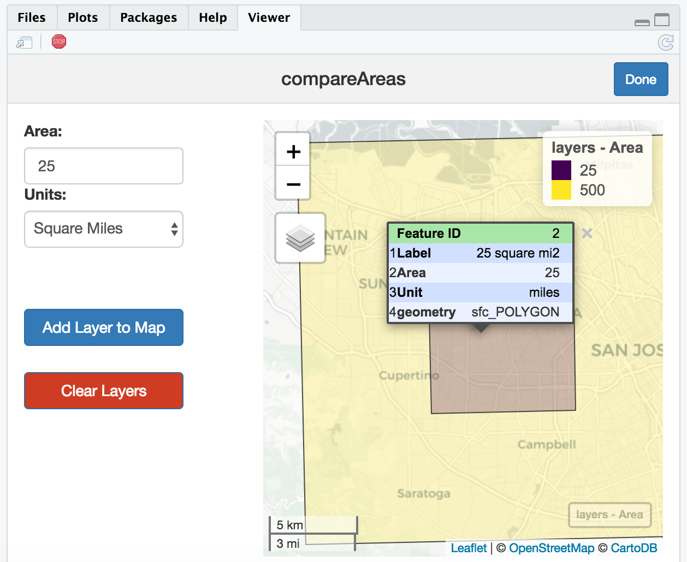

# compareAreas

What's larger--4500 square meters or 1 acre? If you have no idea, this package is for you. `compareAreas` is a Shiny Gadget that creates polygons of a specified area in square meters, kilometers, feet, miles, and acres. 

***

